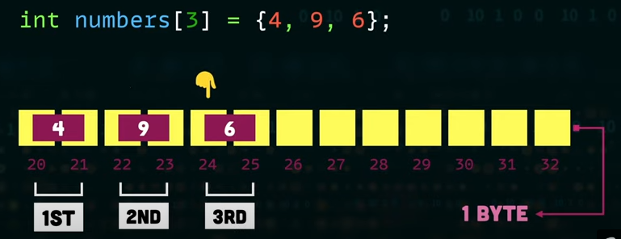

# Estrutura de Dados

Nesta grande evolução do mundo computacional, um fator de relevante importância é a forma de armazenar as informações, já que, informática é a ciência da informação. Então de nada adiantaria o grande desenvolvimento do hardware e do software se a forma de armazenamento e tratamento da informação não acompanhasse esse desenvolvimento. Por isso a importância das estruturas de dados, que nada mais são do que formas otimizadas de armazenamento e tratamento das informações eletronicamente.

As estruturas de dados, na maioria dos casos, baseiam-se nos tipos de armazenamento vistos dia a dia, ou seja, nada mais são do que a transformação de uma forma de armazenamento já conhecida e utilizada no mundo real adaptada para o mundo computacional. Por isso, cada tipo de estrutura de dados possui vantagens e desvantagens e cada uma delas tem sua área de atuação (massa de dados) otimizada.

Os tipos de dados manipulados por um algoritmo podem ser classificados em dois grupos: atômicos e complexos ou compostos. Os tipos atômicos são aqueles cujos elementos do conjunto de valores são indivisíveis, por exemplo: o tipo inteiro, real, caractere e lógico. Por outro lado, os tipos complexos são aqueles cujos elementos do conjunto de valores podem ser decompostos em partes mais simples. Se um tipo de dado pode ser decomposto, então o tipo de dado é dito estruturado.

## Dados Homogêneos

Uma estrutura de dados, que utiliza somente um tipo de dado, em sua deifinição é conhecida como dados homogêneos. Variáveis compostas homogêneas correspondem a posições de memória, identificadas por um mesmo nome, individualizado por índices e cujo conteúdo é composto do mesmo tipo. Sendo os vetores (também conhecidos como estruturas de dados unidimensionais) e as matrizes (estruturas de dados bidimensionais) os representantes dos dados homogêneos.

### Vetor

O vetor é uma estrutura de dados linear que necessita de somente um índice para que seus elementos sejam endereçados. É utilizado para armazenar uma lista de valores do mesmo tipo, ou seja, o tipo vetor permite armazenar mais de um valor em uma mesma variável. Um dado vetor é deinido como tendo um número fixo de células idênticas (seu conteúdo é dividido em posições). Cada célula armazena um e somente um dos valores de dados do vetor. Cada uma das células de um vetor possui seu próprio endereço, ou índice, através do qual pode ser referenciada. Nessa estrutura todos os elementos são do mesmo tipo, e cada um pode receber um valor diferente.

Algumas características do tipo vetor:

- Alocação estática (deve-se conhecer as dimensões da estrutura no momento da declaração).
- Estrutura homogênea.
- Alocação sequencial (bytes contínuos).
- Inserção/Exclusão:
  - Realocação dos elementos.
  - Posição de memória não liberada.

A partir do endereço do primeiro elemento é possível determinar a localização dos demais elementos do vetor. Isso é possível porque os elementos do vetor estão dispostos na memória um ao lado do outro e cada elemento tem o seu tamanho fixo.

> Exemplo: cada elemento do vetor de tipo inteiro ocupada 2 _bytes_ de memória. Além disso, os elementos são armazenados em sequência na memória.

### Matriz

Uma matriz é um arranjo bidimensional ou multidimensional de alocação estática e sequencial. A matriz é uma estrutura de dados que necessita de um índice para referenciar a linha e outro para referenciar a coluna para que seus elementos sejam endereçados. Da mesma forma que um vetor, uma matriz é definida com um tamanho fixo, todos os elementos são do mesmo tipo, cada célula contém somente um valor e os tamanhos dos valores são os mesmos.

Os elementos ocupam posições contíguas na memória. A alocação dos elementos da matriz na memória pode ser feita colocando os elementos linha-por-linha ou coluna-por-coluna.

Uma matriz consiste de dois ou mais vetores deinidos por um conjunto de  elementos. Cada dimensão de uma matriz é um vetor. O primeiro conjunto (dimensão) é considerado o primeiro vetor, o segundo conjunto o segundo vetor e assim sucessivamente.

### Ponteiros

O ponteiro é um tipo de dado como int, char ou float. A diferença do ponteiro em relação aos outros tipos de dados é que uma variável que seja ponteiro guardará um endereço de memória.

Por meio deste endereço pode-se acessar a informação, dizendo que a variável ponteiro aponta para uma posição de memória. O maior problema em relação ao ponteiro é entender quando se está trabalhando com o seu valor, ou seja, o endereço, e quando se está trabalhando com a informação apontada por ele.

#### Passando variáveis para funções por referência

O ponteiro é utilizado para passar variáveis por referência, ou seja, variáveis que podem ter seu conteúdo alterado por funções e mantêm este valor após o término da função.

#### Vetores e matrizes como ponteiros

Vetores nada mais são do que ponteiros com alocação estática de memória, logo tal que o acesso aos índices do vetor podem ser realizados através de aritmética de ponteiros.

## Dados Heterogêneos

Uma estrutura de dados é chamada de heterogênea quando envolve a utilização de mais de um tipo básico de dado (inteiro ou caractere, por exemplo) para representar uma estrutura de dados. Normalmente, este tipo de dado é chamado de registro.

Um registro é uma estrutura de dados que agrupa dados de tipos distintos ou, mais raramente, do mesmo tipo. Um registro de dados é composto por certo número de campos de dados, que são itens de dados individuais. Registros são conjuntos de dados lógicamente relacionados, mas de tipos diferentes (numéricos, lógicos, caractere, etc.).

O conceito de registro visa facilitar o agrupamento de variáveis que não  são do mesmo tipo, mas que guardam estreita relação lógica. Registros correspondem a conjuntos de posições de memória conhecidos por um mesmo nome  e individualizados por identificadores associados a cada conjunto de posições. O registro é um caso mais geral de variável composta na qual os elementos do conjunto não precisam ser, necessariamente, homogêneos ou do mesmo tipo. O registro é constituído por componentes. Cada tipo de dado armazenado em um registro é chamado de campo.

Na variável composta homogênea, a individualização de um elemento é feita através de seus índices, já no registro cada componente é individualizado pela  explicitação de seu identiicador.

## Confira também

- [Tipos de valor](./dotNet/types-variables/value-types/value-types)
